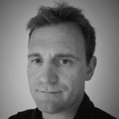

The pages in this ection act as a suppliment to my CV and allow me to provide more detail about my career history and skills.

I found this necessary as it becomes very difficult to summarise 20 years of Software Industry experience in a 3 page CV.

You can find links to my [GitHub](https://github.com/b-hulme) repository and [LinkedIn](https://www.linkedin.com/in/brendan-hulme-a70bb210) profile to also give a better overview of what I do.

## Professional Summary

- Self-motivated, forward-thinking **Solution Architect** and **Team Leader** who understands and excels at the technical, business and social sides of software design and development.

- Worked with numerous architectural patterns including *SOA*, *Microservices*, *Event Driven*, *Event Sourced*, and *Classic layered* architectures, in additional to key development patterns and practises such as *CQRS*, *Mediator*, *Vertical slice*, *Observables* and *SOLID* principles.

- A Cloud professional with expert understanding of Public and Private Cloud technologies including **Azure**, **AWS**, **Kubernetes** and **Helm**, as well as DevOps processes for quality testing and deployment.

- Experience *leading* and *mentoring* multiple development teams of up to 10 members per team, as well as managing remote teams.

## Education

**Bachelor of Engineering in Electronic Engineering**

*1998 - 2003* - University of East Anglia, Norwich, United Kingdom

## Start-up ideas

I have a Startup company project that I work on in my spare time.

I'm not sure if it'll ever make money or even be finished, but it's great fun to do and allows me to further my skills in areas I wouldn't normal get exposure to.

And no, I'm not telling you anything about it! :-)

## Hobbies and Interests

- Walking - Hill and Mountain walks are a common pursuit of mine. I find it helps me think and consolidate my thoughts.

- Aviation - I have Pilots License and I find flying to be a fun challenge with a great view

- Electronics - Love playing around with Electronics and have done since I was about 11 years old

- Science - I'd love to be more specific but I find everything Science related fascinating, from Biology to Physics. I regularly read myself to sleep on science news and articles.

